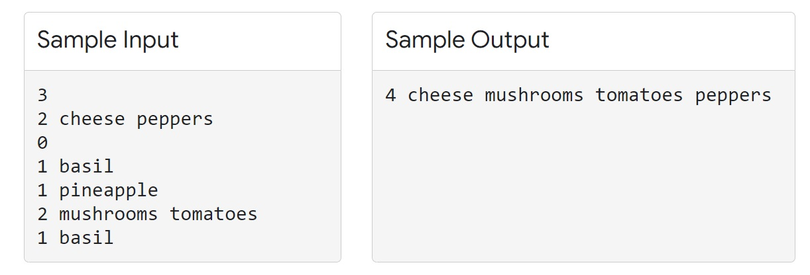

# Practice Round - Hash Code 2022

# One Pizza

# Problem


You are opening a small pizzeria. In fact, your pizzeria is **so** small that you decided to offer only **one type of pizza**. Now you need to decide what ingredients to include (peppers? tomatoes? both?).

Everyone has their own pizza preferences. Each of your potential clients has some ingredients they like, and maybe some ingredients they dislike. Each client will come to your pizzeria if both conditions are true:

1. **all** the ingredients they like are on the pizza, and
2. **none** of the ingredients they dislike are on the pizza


Each client is OK with additional ingredients they neither like or dislike being present on the pizza. Your task is to choose which ingredients to put on your only pizza type, to maximize the number of clients that will visit your pizzeria.


## Input
* The first line contains one integer $ 1 \leqslant  C \leqslant {10}^{5}$ the number of potential clients.
* The following $2XC$ lines describe the clients’ preferences in the following format:

    - First line contains integer  $ 1 \leqslant  L \leqslant 5$, followed by $L$ names of ingredients a client likes, delimited by spaces.
    - Second line contains integer  $ 0 \leqslant  D \leqslant 5$, followed by $D$ names of ingredients a client dislikes, delimited by spaces.
    
    
Each ingredient name consists of between 1 and 15 ASCII characters. Each character is one of the lowercase letters (a-z) or a digit (0-9).


## Submission
The submission should consist of one line consisting of a single number 0≤N followed by a list of N ingredients to put on the only pizza available in the pizzeria, separated by spaces. The list of ingredients should contain only the ingredients mentioned by at least one client, without duplicates.

## Scoring
A solution scores one point for each client that will come to your pizzeria. A client will come to your pizzeria if **all the ingredients they like** are on the pizza and **none of the ingredients they dislike** are on the pizza.


## Sample



In the Sample Input there are $3$ potential clients:

* The first client likes $2$ ingredients, cheese and peppers, and does not dislike anything.
* The second client likes only basil and dislikes only pineapple.
* The third client likes mushrooms and tomatoes and dislikes only basil


The picture below shows the preferences of $3$ potential clients.


In this particular Sample Output, we choose to use 4 ingredients in the pizza: cheese, mushrooms, tomatoes, and peppers.


* The first client likes the pizza because it contains both cheese and peppers, which they like.
* The second client does not like the pizza: it does not contain basil which they like.
* The third client likes the pizza because it contains mushrooms and tomatoes, which they like, and does not contain basil which they do not like.


This means a submission of this output would score $2$ points for this case, because two clients (the first and third ones) would like this pizza.


```python
import os
```


```python


def folder(f_name): 
    try:
        if not os.path.exists(f_name):
            os.makedirs(f_name)
    except OSError:
        print ("Tthe folder could not be created!")
        
def find_the_way(path,file_format):
    files_add = []
    # r=root, d=directories, f = files
    for r, d, f in os.walk(path):
        for file in f:
            if file_format in file:
                files_add.append(os.path.join(r, file))  
    return files_add
files_add=find_the_way('./input/','.txt')


```


```python
def evaluate(outputfolder):
    total=0
    for myfile in files_add:
        like=[]
        dislike=[]
        counter=0
        person=0
        output_filename=outputfolder+myfile[8:]
        with open(output_filename, "r") as file:
            output=file.readline()
        output=output.split(" ")
        output=output[1:]
        with open(myfile, "r") as file:
            while True:
                line=file.readline()
                if line=="":break
                if counter!=0:
                    line=line.replace("\n","")
                    #print(line,counter)
                    line=line.split(" ")

                    if counter%2==0:
                        for i in line[1:]:


                            if i not in dislike:
                                dislike.append(i)


                    else:
                        flag=1
                        for i in line[1:]:
                            if i not in output:
                                flag=0


                            if i not in like:
                                like.append(i)
                        person+=flag

                counter+=1
        print(myfile,person)

        total=total+person
    print(total)
```


```python
files_add
```


    ['./input/a_an_example.in.txt',
     './input/b_basic.in.txt',
     './input/c_coarse.in.txt',
     './input/d_difficult.in.txt',
     './input/e_elaborate.in.txt']


# VERSION 1


```python
outputfolder="outputV1/"
folder(outputfolder)
for myfile in files_add:
    like=[]
    dislike=[]
    counter=0
    with open(myfile, "r") as file:
        while True:
            line=file.readline()
            if line=="":break
            if counter!=0:
                line=line.replace("\n","")
                #print(line,counter)
                line=line.split(" ")
                if counter%2==0:
                    for i in line[1:]:
                        if i not in dislike:
                            dislike.append(i)
      
                else:
                    for i in line[1:]:
                        if i not in like:
                            like.append(i)
            counter+=1
    for i in dislike:
        try:
            like.remove(i)
        except:pass
    temp=(" ".join( i for i in like ))
    temp=str(len(like))+" "+temp
    output_filename=outputfolder+myfile[8:]
    ths = open(output_filename, "w")
    ths.write(temp)
    ths.close()
```


```python
evaluate(outputfolder)
```

    ./input/a_an_example.in.txt 2
    ./input/b_basic.in.txt 5
    ./input/c_coarse.in.txt 1
    ./input/d_difficult.in.txt 1420
    ./input/e_elaborate.in.txt 412
    1840
    

# VERSION 2


```python
outputfolder="outputV2/"
folder(outputfolder)
for myfile in files_add:
    
    like=[]
    dislike=[]
    counter=0
    hist_like = {}
    hist_dislike = {}
    with open(myfile, "r") as file:
        while True:
            line=file.readline()
            if line=="":break
            if counter!=0:
                line=line.replace("\n","")
                line=line.split(" ")
                if counter%2==0:
                    for i in line[1:]:
                        hist_dislike[i] = hist_dislike.get(i, 0) + 1
                        if i not in dislike:
                            dislike.append(i)
                else:
                    for i in line[1:]:
                        hist_like[i] = hist_like.get(i, 0) + 1
                        if i not in like:
                            like.append(i)
            counter+=1
            
    for i in dislike:
        try:
            if hist_like[i]>hist_dislike[i]:
                pass
            else:
                like.remove(i) 
        except:pass
        
        
    temp=(" ".join( i for i in like ))
    temp=str(len(like))+" "+temp
    output_filename=outputfolder+myfile[8:]
    ths = open(output_filename, "w")
    ths.write(temp)
    ths.close()
    print(myfile)
    hist_like={k: v for k, v in sorted(hist_like.items(), key=lambda item: item[1])}
    #print("\n\n\n\n\nLikes:",hist_like)
    hist_dislike={k: v for k, v in sorted(hist_dislike.items(), key=lambda item: item[1])}
    #print("\nDisLikes:",hist_dislike)


```

    ./input/a_an_example.in.txt
    ./input/b_basic.in.txt
    ./input/c_coarse.in.txt
    ./input/d_difficult.in.txt
    ./input/e_elaborate.in.txt
    


```python
evaluate(outputfolder)
```

    ./input/a_an_example.in.txt 2
    ./input/b_basic.in.txt 5
    ./input/c_coarse.in.txt 6
    ./input/d_difficult.in.txt 4048
    ./input/e_elaborate.in.txt 1103
    5164
    

# VERSION 3


```python
outputfolder="outputV3/"
folder(outputfolder)


for myfile in files_add:
    
    like=[]
    dislike=[]
    counter=0
    hist_like = {}
    hist_dislike = {}
    with open(myfile, "r") as file:
        while True:
            line=file.readline()
            if line=="":break
            if counter!=0:
                line=line.replace("\n","")
                line=line.split(" ")
                if counter%2==0:
                    for i in line[1:]:
                        hist_dislike[i] = hist_dislike.get(i, 0) + 1/len(line[1:])
                        if i not in dislike:
                            dislike.append(i)
                else:
                    for i in line[1:]:
                        hist_like[i] = hist_like.get(i, 0) + 1
                        if i not in like:
                            like.append(i)
            counter+=1
            
    for i in dislike:
        try:
            if hist_like[i]>hist_dislike[i]:
                pass
            else:
                like.remove(i) 
        except:pass
        
        
    temp=(" ".join( i for i in like ))
    temp=str(len(like))+" "+temp
    output_filename=outputfolder+myfile[8:]
    ths = open(output_filename, "w")
    ths.write(temp)
    ths.close()
    print(myfile)
    hist_like={k: v for k, v in sorted(hist_like.items(), key=lambda item: item[1])}
    #print("\n\n\n\n\nLikes:",hist_like)
    hist_dislike={k: v for k, v in sorted(hist_dislike.items(), key=lambda item: item[1])}
    #print("\nDisLikes:",hist_dislike)


# In[53]:

```

    ./input/a_an_example.in.txt
    ./input/b_basic.in.txt
    ./input/c_coarse.in.txt
    ./input/d_difficult.in.txt
    ./input/e_elaborate.in.txt
    


```python
evaluate(outputfolder)
```

    ./input/a_an_example.in.txt 2
    ./input/b_basic.in.txt 5
    ./input/c_coarse.in.txt 6
    ./input/d_difficult.in.txt 9195
    ./input/e_elaborate.in.txt 4171
    13379
    
